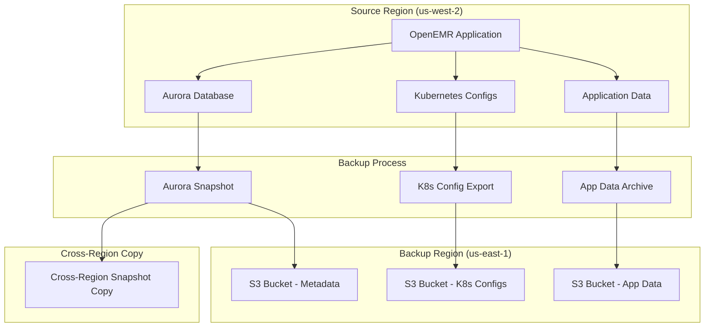
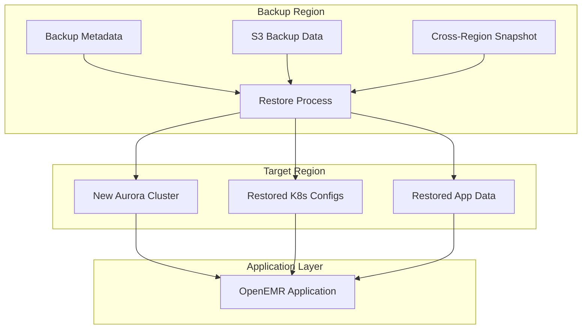

# OpenEMR Backup & Restore Guide

This guide covers the comprehensive backup and restore system for OpenEMR on EKS, designed to protect your critical healthcare data with cross-region disaster recovery capabilities.

## 📋 Table of Contents

- [Overview](#overview)
- [What Gets Backed Up](#what-gets-backed-up)
- [Prerequisites](#prerequisites)
- [Quick Start](#quick-start)
- [Backup Operations](#backup-operations)
- [Restore Operations](#restore-operations)
- [Testing & Validation](#testing--validation)
- [Cross-Region Disaster Recovery](#cross-region-disaster-recovery)
- [Monitoring & Maintenance](#monitoring--maintenance)
- [Troubleshooting](#troubleshooting)

## Overview

The OpenEMR backup system provides:

- ✅ **Automated RDS Aurora snapshots** with cross-region support
- ✅ **Kubernetes configuration backup** (all resources, secrets, configs)
- ✅ **Application data backup** from S3
- ✅ **Cross-region disaster recovery** capabilities
- ✅ **Simple, reliable scripts** with graceful error handling

### Backup Architecture



### Restore Architecture



## What Gets Backed Up

### 🗄️ Database (RDS Aurora)
- **Aurora cluster snapshots** with point-in-time recovery
- **Cross-region snapshot copying** for disaster recovery
- **Automated retention policies** (30 days default)

### ⚙️ Kubernetes Configuration
- All resources in the OpenEMR namespace
- Secrets and ConfigMaps
- Persistent Volume Claims (PVCs)
- Ingress and HPA configurations
- Service definitions

### 📦 Application Data
- OpenEMR sites directory (`/var/www/localhost/htdocs/openemr/sites/`)
- Patient data and uploaded files
- Custom configurations and templates
- Log files and audit trails

### 📋 Backup Metadata
- JSON metadata with restore instructions
- Human-readable reports with status
- Cross-region backup information
- Timestamp and versioning data

## Prerequisites

### Required Tools
```bash
# Verify required tools are installed
aws --version        # AWS CLI v2
kubectl version      # Kubernetes CLI
terraform --version  # Terraform (for infrastructure queries)
jq --version         # JSON processor
```

### AWS Permissions
Your AWS credentials need permissions for:
- RDS snapshot creation and management
- S3 bucket creation and management
- EKS cluster access
- Cross-region resource access

### Infrastructure Requirements
- EKS cluster with OpenEMR deployed
- RDS Aurora cluster (optional - gracefully handled if missing)
- EFS file system with application data
- Cross-region access configured

## Quick Start

### Create a Backup
```bash
# Basic backup to same region
./scripts/backup.sh

# Cross-region backup for disaster recovery
./scripts/backup.sh --backup-region us-east-1

# Custom cluster and namespace
./scripts/backup.sh --cluster-name my-cluster --namespace my-namespace --backup-region us-east-1
```

### Restore from Backup
```bash
# Restore from backup (will prompt for confirmation)
./scripts/restore.sh <backup-bucket> <snapshot-id> <backup-region>

# Example
./scripts/restore.sh openemr-backups-123456789012-openemr-eks-20250815 openemr-eks-aurora-backup-20250815-120000 us-east-1
```


## Backup Operations

### Backup Script Usage

```bash
./scripts/backup.sh [OPTIONS]

Options:
  --cluster-name NAME     EKS cluster name (default: openemr-eks)
  --source-region REGION  Source AWS region (default: us-west-2)
  --backup-region REGION  Backup AWS region (default: same as source)
  --namespace NAMESPACE   Kubernetes namespace (default: openemr)
  --help                  Show help message
```

### Backup Process Flow

1. **Prerequisites Check**
   - Verify AWS credentials and region access
   - Check required tools availability

2. **S3 Bucket Creation**
   - Create encrypted backup bucket in target region
   - Enable versioning and lifecycle policies
   - Configure cross-region replication if needed

3. **RDS Aurora Backup**
   - Detect Aurora cluster automatically
   - Create cluster snapshot with timestamp
   - Handle cluster status gracefully (backing-up, unavailable, etc.)

4. **Kubernetes Configuration Backup**
   - Export all resources from OpenEMR namespace
   - Create compressed archive
   - Upload to S3 backup bucket

5. **Application Data Backup**
   - Access running OpenEMR pods
   - Create tar archive of sites directory
   - Upload to S3 backup bucket

6. **Metadata Generation**
   - Create JSON metadata with restore instructions
   - Generate human-readable report
   - Upload both to S3 backup bucket

### Backup Outputs

After successful backup, you'll receive:

```
✅ Backup ID: openemr-backup-20250815-120000
✅ Backup Bucket: s3://openemr-backups-123456789012-openemr-eks-20250815
✅ Backup Region: us-east-1
✅ Aurora Snapshot: openemr-eks-aurora-backup-20250815-120000

📋 Backup Results:
Aurora RDS: SUCCESS (openemr-eks-aurora-backup-20250815-120000)
Kubernetes Config: SUCCESS (k8s-backup-20250815-120000.tar.gz)
Application Data: SUCCESS (app-data-backup-20250815-120000.tar.gz)

🔄 Restore Command:
   ./restore.sh openemr-backups-123456789012-openemr-eks-20250815 openemr-eks-aurora-backup-20250815-120000 us-east-1
```

## Restore Operations

### Restore Script Usage

```bash
./scripts/restore.sh <backup-bucket> <snapshot-id> [backup-region]

Arguments:
  backup-bucket    S3 bucket containing the backup
  snapshot-id      RDS snapshot identifier (use 'none' if no RDS backup)
  backup-region    AWS region where backup is stored (default: us-west-2)

Environment Variables:
  CLUSTER_NAME     Target EKS cluster name (default: openemr-eks)
  AWS_REGION       Target AWS region (default: us-west-2)
  NAMESPACE        Kubernetes namespace (default: openemr)
```

### Restore Process Flow

1. **Prerequisites Check**
   - Verify AWS credentials and region access
   - Confirm backup bucket exists and is accessible

2. **Backup Metadata Download**
   - Download and parse backup metadata
   - Verify backup integrity and compatibility

3. **RDS Aurora Restore**
   - Create new Aurora cluster from snapshot
   - Handle cross-region snapshot copying if needed
   - Create Aurora Serverless V2 instances
   - Wait for cluster availability

4. **Kubernetes Configuration Restore**
   - Download and extract Kubernetes backup
   - Apply configurations to target cluster
   - Handle conflicts gracefully

5. **Application Data Restore**
   - Download application data backup
   - Extract to running OpenEMR pods
   - Verify data integrity

6. **Verification & Reporting**
   - Provide detailed restore results
   - List new resource identifiers
   - Suggest next steps for verification

### Cross-Region Restore

For cross-region disaster recovery:

```bash
# If snapshot needs to be copied to target region first
aws rds copy-db-cluster-snapshot \
    --source-db-cluster-snapshot-identifier arn:aws:rds:us-west-2:123456789012:cluster-snapshot:openemr-eks-aurora-backup-20250815-120000 \
    --target-db-cluster-snapshot-identifier openemr-eks-aurora-backup-20250815-120000-us-east-1 \
    --source-region us-west-2 \
    --region us-east-1

# Then restore with the copied snapshot
./scripts/restore.sh openemr-backups-123456789012-openemr-eks-20250815 openemr-eks-aurora-backup-20250815-120000-us-east-1 us-east-1
```

## Testing & Validation


## Cross-Region Disaster Recovery

### Setup Cross-Region Backups

```bash
# Regular backups to disaster recovery region
./scripts/backup.sh --backup-region us-east-1

# Automated via cron (example)
0 2 * * * /path/to/scripts/backup.sh --backup-region us-east-1
```

### Disaster Recovery Procedure

1. **Assess the Situation**
   - Determine scope of primary region failure
   - Identify most recent viable backup

2. **Prepare Target Region**
   - Ensure target region infrastructure is ready
   - Verify network connectivity and DNS

3. **Execute Restore**
   ```bash
   # Restore to disaster recovery region
   AWS_REGION=us-east-1 ./scripts/restore.sh \
     openemr-backups-123456789012-openemr-eks-20250815 \
     openemr-eks-aurora-backup-20250815-120000 \
     us-east-1
   ```

4. **Verify and Activate**
   - Test application functionality
   - Update DNS records to point to new region
   - Notify users of the recovery

5. **Monitor and Maintain**
   - Continue backups from new primary region
   - Plan for eventual failback if needed

## Monitoring & Maintenance

### Backup Monitoring

Monitor backup success through:

- **S3 bucket contents** - Verify regular backup uploads
- **RDS snapshots** - Check snapshot creation and retention
- **CloudWatch logs** - Monitor backup script execution
- **Test reports** - Regular restore testing results

### Maintenance Tasks

#### Weekly
- Review backup reports for any failures
- Verify S3 bucket lifecycle policies
- Check RDS snapshot retention

#### Monthly
- Run full backup/restore test cycle
- Review and update disaster recovery procedures
- Audit cross-region backup costs

#### Quarterly
- Test cross-region disaster recovery procedures
- Review and update backup retention policies
- Validate backup/restore documentation

### Cost Optimization

- **S3 Lifecycle Policies** - Automatic transition to cheaper storage classes
- **RDS Snapshot Cleanup** - Automated deletion of old snapshots
- **Cross-Region Optimization** - Balance cost vs. recovery requirements

## Troubleshooting

### Common Issues

#### Backup Script Fails

**Issue**: AWS credentials not configured
```bash
# Solution: Configure AWS credentials
aws configure
# or
export AWS_PROFILE=your-profile
```

**Issue**: Kubernetes cluster not accessible
```bash
# Solution: Update kubeconfig
aws eks update-kubeconfig --region us-west-2 --name openemr-eks
```

**Issue**: RDS cluster in backing-up state
```
# This is normal - the script will skip and continue
# The cluster will be available for backup on the next run
```

#### Restore Script Fails

**Issue**: Backup bucket not found
```bash
# Solution: Verify bucket name and region
aws s3 ls s3://your-backup-bucket --region us-east-1
```

**Issue**: Cross-region snapshot not available
```bash
# Solution: Copy snapshot to target region first
aws rds copy-db-cluster-snapshot \
  --source-db-cluster-snapshot-identifier arn:aws:rds:source-region:account:cluster-snapshot:snapshot-id \
  --target-db-cluster-snapshot-identifier new-snapshot-id \
  --source-region source-region \
  --region target-region
```

#### Test Script Issues

**Issue**: Application not ready
```bash
# Solution: Check pod status and logs
kubectl get pods -n openemr
kubectl logs -f deployment/openemr -n openemr
```

### Getting Help

1. **Check script logs** - All scripts provide detailed logging
2. **Review S3 backup reports** - Human-readable status reports
3. **Verify AWS resources** - Check RDS, S3, and EKS in AWS console
4. **Test in isolation** - Run individual backup/restore operations
5. **Check documentation** - Review this guide and troubleshooting section

### Support Information

For additional support:
- Review the comprehensive test reports
- Check AWS CloudWatch logs for detailed execution traces
- Verify backup metadata JSON files for restore instructions
- Test restore procedures in a non-production environment first

---

## 🔒 Security Considerations

- All backups are encrypted at rest using S3 server-side encryption
- RDS snapshots inherit cluster encryption settings
- Cross-region transfers use AWS secure channels
- Backup metadata includes audit trail information
- Access to backup buckets should be restricted via IAM policies

## 📊 Performance Considerations

- Backup duration depends on data size and network speed
- RDS snapshots are incremental after the first full snapshot
- Cross-region transfers may take additional time
- Restore operations for Aurora clusters can take time (sometimes multiple hours)
- Application data restore is usually the fastest component

---

*This guide covers the comprehensive backup and restore system for OpenEMR on EKS. For additional questions or support, refer to the troubleshooting section or review the detailed test reports generated by the test script.*